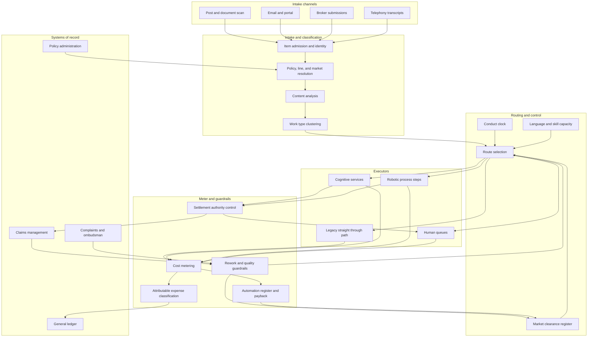

# Throughline

**Source:** `ai-in-insurance/deloitte-IE_Insurance Whitepaper_0318/`
**Domain:** `ai-ins`
**One-liner:** An operating-cost control plane for Irish-domiciled carriers serving multiple EU markets, which meters every inbound work item through recognition, clustering, and routing so that automation is booked in expense-ratio basis points and blocked wherever a market's conduct clock or pricing rules forbid it.
**Wedge:** Ireland-based EU hub operations at mid-sized general insurers and managing general agents — the shared service centre that handles claims notification, document intake, broker submissions, and policy servicing for branches passporting into three to eight member states, starting with property and motor claims intake where the source identifies the largest cost centre.
**Positioning:** Cognitive operations accounting for a cross-border insurance back office. A robotic process automation centre of excellence counts bots and hours saved; Throughline makes the work item the accounting unit, ties each touch to attributable expense under IFRS 17 and to the statutory clock of the member state the policy was written in, and refuses to automate a step whose jurisdiction has not cleared it.

## Market research synthesis

### Thesis from source

The Irish edition of this whitepaper is introduced by Deloitte Ireland's Robotics and Cognitive Automation practice, and the foreword makes a sharper commercial argument than the body it precedes. It states that there is a huge opportunity for the Irish market to innovate and embrace new technologies to drive down costs and build a competitive edge, that interest in AI and robotics as a force for disruption, growth and cost reduction has been rising, and that the industry faces a binary choice: exploit AI to disrupt existing business practices, or face disruption from non-traditional competitors. It also reports, citing the companion study "The Robots are Ready. Are You?", that awareness of robotics in Ireland is high, that continuous improvement and automation sit at the top of the strategic agenda for many business leaders, and that those leaders are convinced robotics will eventually support a sizeable portion of their activities. The gap the foreword implies is therefore not one of appetite or awareness. It is a gap between conviction that automation will carry a sizeable share of the work and any means of proving which share, at what cost, in which market.

The body supplies the operational evidence. It states plainly that the claims processing department is traditionally the most labour-intensive and therefore the largest cost centre for insurers, while the work itself is highly standardised and repetitive and so unusually eligible for automation. Critically, it observes that insurers' legacy systems are *already* capable of partially automated processes in quotation, contract, and claims — what modern applications add is better content recognition, more intelligent prioritisation, and materially reduced response time. This is the detail that reframes the product: the target is not a greenfield automation of a manual process, but the seam between existing partial automation, new cognitive services, and the humans who absorb everything the other two drop. The document names the workflow explicitly as automated input management in three steps — data analysis, then data clustering, then routing — whose purpose is to route each issue to the right internal contact or solution provider while avoiding subsequent manual rework.

The case evidence gives the economics and the failure modes. Fukoku Mutual Life's claims application increased productivity by 30 percent, expects return on investment in under two years, and delivers annual savings of JPY 140M, calculating pay-outs from administered procedure, hospitalisation period, medical history and policy conditions, scanning the contract for special coverage clauses to prevent payment oversights — and still submitting the calculated pay-out to a member of staff who approves and releases it. Basler Versicherungen automates parts of glass damage claims including payment transactions; Zurich UK piloted automation of injury claims. On the servicing side, Aetna's assistant answers around 20,000 questions daily, improved from high-quality responses only 35 percent of the time to 80 percent within a year, has a staff member who checks and enriches answers, and directs the customer to a dedicated agent when it does not know. Versicherungskammer Bayern uses AI to sort and classify customer email. The document also sizes the loss side of poor handling: fraud-related costs run to billions of euros and an estimated 10 percent of overall claims expenditure.

Two further figures set the constraint. Only 1.33 percent of insurance companies invested in AI in 2016, against 32 percent in software and internet technologies, while 95 percent of insurance executives intend to start or continue investing and 98 percent believe cognitive computing will be disruptive — a spread that predicts a wave of underprepared programmes rather than a wave of results. And the customer-consent data is uneven by line: 48 percent would share behavioural data for motor, 40 percent for health, 38 percent for home. Taken with the foreword's cost mandate, the buildable product is an accounting and control layer rather than another automation tool. It meters each inbound work item across bot, cognitive service, legacy straight-through path, and human touch; converts that metering into attributable expense and into a defensible claim on the expense ratio; and holds the jurisdictional rules that decide whether a given step may be automated at all for a policy written in Dublin, Frankfurt, or Madrid.

### Buyer & economic model

- **Primary buyer:** Chief Operating Officer of the Irish carrier or hub entity, co-sponsored by the Chief Financial Officer who owns the expense ratio target and the automation business case.
- **Users:** operations managers and team leaders in claims intake, servicing, and broker support (daily); the automation or robotics centre of excellence (daily); claims and servicing agents receiving routed work (continuous); finance business partners and expense analysts (monthly close); conduct and compliance officers per member state (on exception and at review); complaints handlers (on escalation); vendor and outsourcing managers (quarterly); internal audit and operational risk (periodic).
- **Budget owner / value metric:** the operating expense base of the hub entity and the automation programme budget. The primary value metric is expense-ratio basis points removed per line and per member state, net of automation run cost, with straight-through rate counted only where no downstream rework occurred. Secondary metrics are cost per work item, response time against the statutory clock, and claims leakage avoided — recognising the source's finding that fraud alone is around 10 percent of claims expenditure.
- **Competing status quo:** an RPA centre of excellence with a bot inventory and a benefits spreadsheet denominated in hours saved, sitting beside a workflow engine inside the policy administration system, a separate document capture tool, a chatbot on the customer portal, and finance allocating operations cost by headcount. Hours saved never reconcile to the expense ratio because released hours are re-absorbed, the conduct clock lives in each market's local procedure manual, and nobody can say what a single escape-of-water notification actually costs to bring to disposal.

### Domain constraints

- **Regulatory / trust / safety:** an Irish entity writing business into other member states on freedom of establishment or freedom of services carries Irish prudential and conduct supervision plus the local conduct rules of each host market — different claims acknowledgement and decision timelines, different complaint escalation routes and ombudsman regimes, different language-of-contract duties. Irish restrictions on differential pricing mean renewal price cannot be set from inferred price sensitivity, so any automation touching renewal pricing must be provably blind to those signals. Solvency II operational risk and the own risk and solvency assessment require the firm to understand and control its automated processes and its outsourcing dependencies, including intragroup service arrangements. IFRS 17 requires expenses to be split between those attributable to insurance contracts and those that are not, which means an automation saving is only creditable to the insurance result if it is attributed correctly.
- **Data sensitivity:** intake carries health data in injury and health claims, criminal-allegation data in fraud referrals, and household and financial circumstances throughout. Cross-border processing between the hub and its branches is a transfer-and-purpose question under GDPR even inside the European Economic Area when the controller differs per branch. The source's own consent figures — 48 percent motor, 40 percent health, 38 percent home — mean behavioural data cannot be assumed available and coverage varies by line, so routing logic must degrade gracefully where consent is absent.
- **Change-management realities:** the source says awareness is high and conviction is high, which in practice means many small automations already exist and are unregistered. The first task is inventory, not construction. Legacy systems already perform partial automation, so a new cognitive service usually inserts into an existing chain rather than replacing it, and the benefit is easily double-counted. Released capacity in a hub is frequently re-absorbed by branch growth, which is why the Fukoku-style two-year payback has to be tracked against booked expense rather than modelled hours. Multilingual staffing constraints in Dublin cap how much host-market work can be repatriated to humans when automation is suspended.

## Business requirements

- BR-1: Every inbound work item must carry a single identity from intake to disposal, so that its total handling cost and elapsed time can be stated regardless of how many bots, cognitive services, legacy paths, and humans touched it.
- BR-2: Automation benefit must be reported as expense-ratio basis points net of automation run cost and attributed per line of business and per member state, and hours saved may not be presented as benefit unless the released capacity has a recorded disposition.
- BR-3: Straight-through completion may only be counted where the item reached disposal without downstream rework, reopening, or complaint within the defined observation window.
- BR-4: Each work item must be governed by the statutory and contractual clock of the member state in which its policy was written, and any routing or queuing decision that would breach that clock must escalate before the breach rather than report it after.
- BR-5: No automated step may be activated for a member state until that state's conduct clearance is recorded, and the same automation may run in one market while remaining blocked in another without a separate build.
- BR-6: Renewal pricing and retention workflows must be demonstrably free of inferred price-sensitivity signals, so that the operation can evidence compliance with restrictions on differential pricing.
- BR-7: Every automated pay-out, settlement, or refund must have a defined human approval and release step with a monetary authority limit, and the released amount must be reconcilable to the calculated amount.
- BR-8: Fraud and special-investigation referral rates must be monitored per automated route and must not deteriorate relative to the human baseline, given that fraud is estimated at around 10 percent of claims expenditure.
- BR-9: Customer-facing conversational handling must publish its answer-quality rate and its escalation rate to a named human, and must escalate rather than answer when confidence or entitlement is unclear.
- BR-10: Operations cost must be classified as attributable or non-attributable to insurance contracts at the point of metering, so that expense savings flow correctly into the insurance result rather than being reclassified at close.
- BR-11: A complete register of automated steps, their owners, their host-market clearances, and their failure behaviour must be maintained and reportable to operational risk and internal audit, because an unregistered automation is an uncontrolled dependency.
- BR-12: Each automation must have a stated payback period and be reported against it at least quarterly, with continuation of spend contingent on booked benefit rather than forecast benefit.

## User stories

Canonical user stories live in sibling [USER_STORIES.md](USER_STORIES.md).

## System design

### Overview

Throughline sits in front of the operation rather than inside any one system. Every inbound artefact — post scan, email, broker submission, portal notification, telephony transcript, partner file — is admitted through a single intake that assigns a work item identity, resolves the governing policy and therefore the governing member state, and runs the source's three-step pattern: analyse content, cluster into a work type, then route. Routing is where the product's opinion lives. It selects a route across four kinds of executor — a legacy straight-through path, a cognitive service, a robotic process step, or a human queue — subject to the host market's clearance for that step, the item's conduct clock, and available multilingual human capacity. Every touch emits a metered event carrying duration, executor, unit cost, and attributable-expense classification. Disposal closes the item and starts the rework observation window. Two derived surfaces consume the meter: a finance surface that turns metered events into expense-ratio movement by line and market and reconciles it to booked cost, and a control surface that holds the automation register, the per-market clearances, the authority limits on automated pay-outs, and the guardrails that suspend a route when rework, referral, or answer-quality metrics deteriorate.

### Actors & boundaries

- **Actors:** operations manager, claims and servicing agent, automation centre of excellence lead, finance business partner, host-market conduct officer, complaints handler, vendor and outsourcing manager, operational risk and internal audit, and the policyholder or broker who originated the item.
- **Trust boundary:** the policy administration, claims, and general ledger systems remain systems of record; Throughline owns the work item, the route, the meter, and the clearance state. Cognitive services and robotic steps are executors invoked under a registered contract and never hold settlement authority — a pay-out is calculated inside the chain but released by a named human within an authority limit, following the pattern the source describes at Fukoku. Personal data stays inside the controller boundary of the branch that owns the policy; what crosses to the hub's shared surfaces is the work item metadata, the meter, and the clearance state.
- **Human-in-the-loop points:** pay-out approval and release; conduct clearance grant and withdrawal per market; vulnerable-customer and hardship routing; escalation from conversational handling; suspension of a degraded route; classification of a disputed expense attribution; sign-off of quarterly payback reporting.

### Core capabilities

1. **Unified intake and item identity** — admits every channel, assigns one identity, resolves governing policy, line, and member state.
2. **Recognition and clustering** — content analysis and clustering into work types with confidence, following the source's data analysis then clustering sequence.
3. **Route selection and dispatch** — chooses among legacy straight-through, cognitive service, robotic step, and human queue under clearance, clock, and capacity constraints.
4. **Conduct clock management** — per-market statutory and contractual deadlines with pre-breach escalation.
5. **Jurisdictional clearance register** — which automated steps are permitted in which member state, by whom, on what evidence, and with what withdrawal trigger.
6. **Cost metering and expense attribution** — per-touch duration, executor, unit cost, and attributable versus non-attributable classification.
7. **Settlement authority control** — calculated versus released amounts, approver identity, authority limits, and reconciliation.
8. **Quality and rework guardrails** — rework, reopen, complaint, fraud-referral, and answer-quality monitoring with automatic route suspension.
9. **Automation register and payback reporting** — inventory, ownership, failure behaviour, stated payback, and booked benefit by quarter.
10. **Capacity and language planning** — human queue capacity by language and skill, used both for routing and for judging whether a route can safely be suspended.

### Conceptual data

- **Primary entities:** WorkItem, IntakeChannel, WorkType, ClassificationResult, Route, RouteStep, Executor, HumanQueue, ConductClock, MarketClearance, MeteredTouch, ExpenseAttribution, SettlementAuthorisation, ReworkEvent, RouteGuardrail, AutomationRegistryEntry, PaybackStatement, CapacityProfile, ConsentRecord.
- **Critical events:** item admitted, classified and clustered, routed, step executed by executor, clock warning raised, clearance granted or withdrawn, pay-out calculated, pay-out released by approver, item disposed, rework observed, guardrail breached, route suspended, expense attributed, payback statement issued.
- **Retention / audit needs:** work item route history, automated decisions, and settlement authorisations must be retained for the longest of the host market's complaint and ombudsman window, the Irish record-keeping obligation, and the claim's own development tail. Metered touches and expense attributions are retained to the statutory accounting period and must remain reconcilable to the general ledger after restatement. Clearance grants and withdrawals are permanent records with named officers. Personal data in intake artefacts follows the controller branch's retention schedule and is deleted independently of the metering record, which retains only non-identifying item metadata.

### Integrations (conceptual)

- **Systems of record:** policy administration per market, claims management, general ledger and expense allocation, complaints and ombudsman case management, broker and intermediary platforms, payments and treasury.
- **Upstream signals:** document capture and optical recognition, email and post digitisation, telephony and transcription, portal and app notifications, classification and clustering services, fraud scoring, consent management records, catastrophe event feeds that reshape intake volume.
- **Downstream actions:** work dispatch into human queues and bot orchestrators, invocation of cognitive services and legacy straight-through paths, pay-out release instructions within authority limits, route suspension notices, conduct-clock escalations to team leaders, expense postings and attribution tags to finance, and quarterly payback and register extracts for operational risk and audit.

### High-level architecture

Intake and routing run at operational speed; metering and clearance are durable and must be reconcilable months later. The clearance register is deliberately the narrow gate — a route cannot dispatch a step into a market that has not cleared it, which is what stops a Dublin-built automation from quietly running against Spanish or German conduct rules.

### Success metrics

- **Leading:** share of inbound volume admitted through unified intake; classification and clustering accuracy by work type; first-time-right routing rate; proportion of automated steps with recorded clearance per market; pre-breach conduct-clock escalations as a share of total breaches; conversational answer-quality rate and escalation rate, benchmarked against the source's improvement from 35 percent to 80 percent within a year; automated pay-outs released within authority limits with clean reconciliation.
- **Lagging:** expense-ratio basis points removed per line and member state, net of automation run cost; cost per work item by type; rework-adjusted straight-through rate; median and tail response time against statutory clocks; fraud referral rate on automated routes versus human baseline; claims leakage against the roughly 10 percent of claims expenditure the source attributes to fraud; share of automations achieving their stated payback within two years, the benchmark the source's Fukoku case sets; number of unregistered automations found by audit, targeting zero.

## OpenAPI skeleton

Canonical HTTP surface lives in sibling [openapi.yaml](openapi.yaml). Summary:

- **Base path:** `/v1/...`
- **Auth:** `X-API-Key` for intake channels, bot orchestrators, and cognitive service callbacks; Bearer JWT for operations, finance, and conduct users.
- **Resource groups:** Intake, Classification, Routing, Clearance, Metering, Settlement, Assurance.
