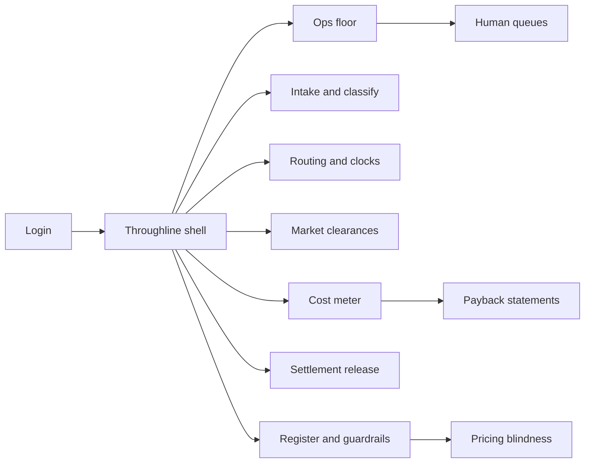
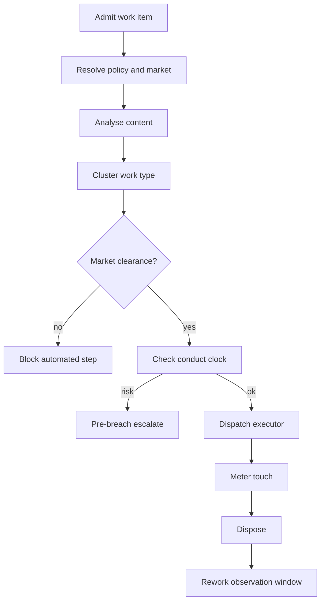

# Throughline — Web app

**Product:** [PRODUCT.md](./PRODUCT.md)
**Primary surface:** Cross-border hub operations console (Irish EU shared-service ops + automation CoE)
**Secondary surfaces:** Host-market clearance desk (conduct officers); finance expense-ratio meter; settlement release queue
**Design thesis:** Throughline is a customs-and-metering hall for insurance work items — every inbound artefact gets one passport (identity), one governing member-state clock, and a toll record of every bot, cognitive, legacy, and human touch. The UI metaphor is a routing apron under jurisdictional gates, not an RPA “hours saved” scoreboard. Visual language is Atlantic slate and signal-orange clocks on a cool harbour ground: cleared markets read sea-green; uncleared steps stay harbour-locked; expense-ratio basis points are the only benefit badge that looks booked.

## UX research synthesis

### Category peers (best-in-class)

- **ServiceNow Customer Service Management:** Unified case identity, SLA clocks, and multi-queue routing. Steal: one work-item identity across channels with deadline chrome; reject ITSM ticket aesthetics for insurance conduct clocks.
- **Celonis (process intelligence):** Cost and rework visibility per process variant. Steal: cost-per-item and rework-adjusted STP as first-class metrics; reject pure process-mining exploration as the ops home.
- **Pega Customer Service:** Intelligent routing with skill/language and exception paths. Steal: route selection under capacity and vulnerability pull-outs; reject opaque “next-best-action” without clearance state.
- **UiPath Insights / Automation Hub (as anti-pattern peer):** Bot inventory and hours-saved benefits. Steal: automation register completeness; **reject** hours-saved as the hero benefit — Throughline books expense-ratio bps with capacity disposition.

### Patterns to adopt / reject

- **Adopt:** Single work-item identity intake→disposal; analyse→cluster→route; per-market clearance gates; pre-breach conduct-clock escalation; metered touches with attributable/non-attributable tags; human release on automated pay-outs; rework-adjusted STP; payback on booked expense; pricing-blindness attestation for renewal flows.
- **Reject:** Hours-saved as benefit without disposition; counting STP with silent rework; one-build-all-markets automation; chatbot deflection without quality/escalation rates; double-counting legacy STP when inserting cognitive steps.

### Trust, density, and workflow constraints from PRODUCT.md

Irish hub + host-market conduct (BR-4, BR-5); differential pricing restrictions (BR-6); IFRS 17 expense attribution (BR-10); settlement always human-released within authority (BR-7); fraud referral must not degrade (BR-8). Density is finance-grade on metering and payback; ops floor is clock-first; clearance desk is sparse and decisive.

## Information architecture

### Nav model

### Roles → default home

| Role | Default home | Why |
|------|--------------|-----|
| Operations manager (claims intake) | Ops floor — clocks + misroute alerts | Prioritise by binding deadline (BR-4) |
| Claims / servicing agent | Assigned queue | Continuous routed work |
| Automation CoE lead | Automation register + payback | Auditable inventory (BR-11, BR-12) |
| Finance business partner | Cost meter / expense-ratio movement | Booked bps not hours (BR-2, BR-10) |
| Host-market conduct officer | Clearance desk | Grant/withdraw per step (BR-5) |
| Complaints handler | Work-item route history | Ombudsman-ready trail |

### Cross-links to OpenAPI resources

| Nav area | OpenAPI tags / resources |
|----------|---------------------------|
| Work items, route history | Intake |
| Classification, work types | Classification |
| Routing, clock escalations, capacity | Routing |
| Clearances, withdrawal | Clearance |
| Touches, unit cost, expense-ratio, payback | Metering |
| Settlement authorisations and release | Settlement |
| Guardrails, suspensions, register, pricing blindness | Assurance |

## Screen inventory

### Ops floor

- **Purpose:** Live hub view: volume by market, clocks nearing breach, rework spikes, cost-per-item trend.
- **Entry:** Ops manager login.
- **Layout regions:** Brand + hub entity; market clock heatstrip; intake volume by channel; rework/guardrail alerts; cost-per-item sparkline.
- **Primary actions:** Open clock escalations; open degraded route; drill work type.
- **Empty / loading / error:** Empty queues = healthy with last clearance sync time.
- **BR / story ties:** BR-1, BR-4; ops manager stories.

### Intake and classification

- **Purpose:** Admit all channels under one identity; analyse then cluster into work type.
- **Entry:** Ops nav; exception from low-confidence cluster.
- **Layout regions:** Channel feed; work-item identity; policy/market resolution; classification confidence; cluster assignment.
- **Primary actions:** Confirm/override cluster; force vulnerable pull-out; open item.
- **Empty / loading / error:** Unresolved policy = hold queue, not silent default market.
- **BR / story ties:** BR-1; source three-step pattern.

### Routing apron

- **Purpose:** Select legacy STP / cognitive / RPA / human under clearance, clock, and language capacity.
- **Entry:** After cluster; item detail.
- **Layout regions:** Candidate executors; clearance lamps per market; clock remaining; capacity by language; chosen route preview.
- **Primary actions:** Dispatch; override to human with reason; block if clearance missing.
- **Empty / loading / error:** Uncleared step = harbour lock, cannot dispatch.
- **BR / story ties:** BR-5; CoE multi-market activation story.

### Conduct clock board

- **Purpose:** Per-item statutory/contractual deadlines by member state; escalate before breach.
- **Entry:** Ops floor alert; routing nav.
- **Layout regions:** Queue sorted by time-to-breach; market filters; escalation log.
- **Primary actions:** Escalate; re-prioritise; open item.
- **Empty / loading / error:** Post-breach without prior escalation = coral control finding.
- **BR / story ties:** BR-4.

### Human queues (agent)

- **Purpose:** Work assigned after routing, including vulnerable/hardship pull-outs and conversational escalations.
- **Entry:** Agent login.
- **Layout regions:** Queue list with clock; item brief; prior automated touches (read-only); action pane.
- **Primary actions:** Complete step; escalate; request settlement release if in path.
- **Empty / loading / error:** Empty = capacity available message for planners.
- **BR / story ties:** BR-9; complaints vulnerable story.

### Market clearance desk

- **Purpose:** Grant or withdraw automated-step clearance per host market without separate builds.
- **Entry:** Conduct officer home.
- **Layout regions:** Step × market matrix; evidence; named officer; withdrawal triggers.
- **Primary actions:** Grant; withdraw; attach evidence; notify CoE.
- **Empty / loading / error:** Pending clearance = step dark in that market only.
- **BR / story ties:** BR-5; compliance stories.

### Cost meter and expense ratio

- **Purpose:** Metered touches → unit cost → attributable classification → expense-ratio bps by line and market.
- **Entry:** Finance home; CoE secondary.
- **Layout regions:** Touch ledger; attributable vs non-attributable; bps movement net of run cost; capacity disposition register.
- **Primary actions:** Reconcile to ledger; record disposition of released hours; export close pack.
- **Empty / loading / error:** Hours without disposition cannot badge as benefit (BR-2).
- **BR / story ties:** BR-2, BR-10; finance stories.

### Rework-adjusted STP

- **Purpose:** Count straight-through only when no rework/reopen/complaint in observation window.
- **Entry:** Ops / CoE analytics.
- **Layout regions:** Gross STP vs adjusted STP; rework reasons; route comparison.
- **Primary actions:** Suspend route on deterioration; open guardrail.
- **Empty / loading / error:** Window still open = provisional label.
- **BR / story ties:** BR-3.

### Settlement release

- **Purpose:** Calculated pay-out → named human release within authority; reconcile amounts.
- **Entry:** Approver queue; item path.
- **Layout regions:** Calculated vs to-release; approver; authority limit; reconciliation state.
- **Primary actions:** Release; reject; escalate over-limit.
- **Empty / loading / error:** Over-limit without escalation path = block.
- **BR / story ties:** BR-7; Fukoku pattern.

### Automation register and payback

- **Purpose:** Inventory of steps, owners, clearances, failure behaviour; quarterly booked payback.
- **Entry:** CoE default.
- **Layout regions:** Register table; market clearance summary; payback vs stated period; unregistered-automation incident rail.
- **Primary actions:** Register step; retire failed payback; open incremental benefit vs legacy baseline.
- **Empty / loading / error:** Unregistered automation found = coral incident.
- **BR / story ties:** BR-11, BR-12.

### Guardrails and suspensions

- **Purpose:** Suspend routes when rework, fraud referral, or answer quality deteriorates.
- **Entry:** Assurance nav; alert.
- **Layout regions:** Thresholds; breach timeline; suspension state; resume requires clearance revisit if market-impacting.
- **Primary actions:** Suspend; notify capacity planning; request resume.
- **Empty / loading / error:** Active suspension = visible on routing apron lamps.
- **BR / story ties:** BR-3, BR-8, BR-9.

### Pricing-blindness attestation

- **Purpose:** Evidence renewal/retention automation cannot see inferred price-sensitivity signals.
- **Entry:** Conduct / assurance.
- **Layout regions:** Signal inventory; blocked features; attestation record; review history.
- **Primary actions:** Attest; revoke; export for differential-pricing review.
- **Empty / loading / error:** Missing attestation = renewal automation blocked.
- **BR / story ties:** BR-6.

### Work-item dossier (complaints)

- **Purpose:** Full route history for ombudsman/complaint response.
- **Entry:** Complaints handler search.
- **Layout regions:** Timeline of executors and decisions; policy versions; settlement authorisations; meter summary (non-sensitive).
- **Primary actions:** Export pack; pull to human queue if still open.
- **Empty / loading / error:** Partial history = retention boundary noted.
- **BR / story ties:** Complaints stories; BR-1.

### Capacity and language planning

- **Purpose:** Human capacity by language/skill for routing and safe suspension.
- **Entry:** Ops planner; CoE.
- **Layout regions:** Capacity profiles; backlog vs clock risk; repatriation limits.
- **Primary actions:** Adjust profile; simulate suspension impact.
- **Empty / loading / error:** Missing language capacity = block repatriation of suspended volume.
- **BR / story ties:** Change-management multilingual constraint.

## Key flows

1. **Intake to disposal** — admit → resolve market → classify → cluster → route under clearance/clock → meter touches → dispose → observe rework window; failure: uncleared step or clock escalation.

2. **Per-market activation** — register step → host officer grants clearance for DE not ES → automation runs only where green (BR-5).

3. **Settlement release** — calculate → human approve within limit → release → reconcile calculated vs released (BR-7).

4. **Benefit booking** — meter attributable cost → net run cost → expense-ratio bps + capacity disposition → payback statement (BR-2, BR-12).

5. **Guardrail suspend** — rework/fraud/answer-quality breach → suspend route → capacity plan absorbs → clearance may be revisited.

## Design system

### Tokens (CSS variables)

- `--color-ink: #E7EEF4` — text on harbour ground
- `--color-harbour-950: #0A141C` — app ground
- `--color-harbour-900: #12202B` — panels
- `--color-harbour-700: #2A3E4E` — dividers
- `--color-atlantic: #2F6F8F` — brand / primary (Atlantic blue)
- `--color-sea: #2A9B7A` — cleared / booked bps
- `--color-signal: #E07A2F` — conduct clock warning (signal orange)
- `--color-coral: #D94F45` — breach / suspension / unregistered
- `--color-fog: #8AA0B0` — secondary labels
- `--color-brand: #7EB6C9` — Throughline wordmark
- `--font-display: "Sora", sans-serif` — ops titles and bps numerals
- `--font-body: "IBM Plex Sans", sans-serif` — tables and forms
- `--font-mono: "IBM Plex Mono", monospace` — work-item ids, market codes
- `--space-1`…`--space-8`: 4px scale
- `--radius-sm: 4px`; `--radius-md: 8px`
- `--motion-clock: 200ms ease-in-out` — signal pulse approaching breach
- `--motion-clear: 180ms ease-out` — clearance lamp on
- `--motion-lock: 160ms ease-in` — harbour lock when uncleared
- Atmosphere: cool harbour gradient with faint ferry-lane diagonals (cross-border routes); no shamrock kitsch; no purple automation glow.

### Typography & brand

- Display for expense-ratio bps and clock boards; mono for work-item and market codes (IE/DE/ES).
- Wordmark in chrome on metering and clearance screens; ops floor never titled only “Dashboard.”
- Login: brand-first (“One item. One clock. One meter.”); one CTA.

### Do / don’t

- **Do:** Passport identity; market lamps; pre-breach clocks; booked bps; human settlement release; rework-adjusted STP.
- **Don’t:** Hours-saved hero KPIs; all-markets auto-on; STP with hidden rework; unsigned pay-outs; purple bot mascots.

### Accessibility & domain trust cues

- AA+ on signal orange and sea green vs harbour; clearance state uses lamp + text (Cleared/Blocked).
- Live regions for clock escalations and suspensions.
- Focus order: clearance → clock → route → meter → settlement.
- Complaint dossiers export redacted personal content per branch controller rules.

## Component patterns

- **WorkItemPassport** — single identity with market, line, channel.
- **ClearanceLampMatrix** — step × member-state clearance state.
- **ConductClockChip** — time-to-breach with pre-breach escalate.
- **RouteApron** — executor choices under constraints.
- **MeteredTouchRow** — duration, executor, unit cost, attributable flag.
- **ExpenseBpsBadge** — booked benefit only with disposition.
- **ReworkAdjustedStp** — gross vs adjusted STP.
- **SettlementReleaseCard** — calculated vs released + authority.
- **AutomationRegisterRow** — owner, clearances, failure behaviour, payback.
- **PricingBlindnessSeal** — renewal automation attestation.
- **VulnerablePullout** — structural exit from automated routing.

## Out of scope for v1 web

- Building the cognitive models themselves; replacing policy admin or claims SoR; customer-facing chatbot UI beyond quality metrics; native mobile; non-EU hub templates in v1; full multilingual content translation IDE.
